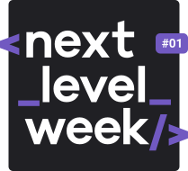

  
  <p align="center">
  
</p>

_________

### 🤔 O que é o Next Level Week?

Criado pela Rocketseat, o NLW é uma semana prática com muito código, desafios, networking e um único objetivo: te levar para o próximo nível.

Através do nosso método você vai aprender novas ferramentas, conhecer novas tecnologias e descobrir hacks que vão impulsionar a sua carreira.

Um evento online e totalmente gratuito que vai te ajudar a dar o próximo passo na sua evolução como dev.

_________

### ✨ Sobre o projeto:


O Ecoleta é um projeto criado para gerenciar o processo de coleta de lixo nas cidades. Com ele, é possível ajudar pessoas a encontrarem pontos de coleta de uma forma mais eficiente.

##[🎨 Layout](https://www.figma.com/file/1SxgOMojOB2zYT0Mdk28lB/?viewer=1&node-id=).

<p align="center">

</p>

_________

## 🚀 Tecnologias

Esse projeto foi desenvolvido com as seguintes tecnologias:

- [React](https://reactjs.org)
- [TypeScript](https://www.typescriptlang.org/)
- [Node.js](https://nodejs.org/en/)
- [Knex](http://knexjs.org/)
- [SQLite](https://www.sqlite.org/index.html)
- [React Native](https://facebook.github.io/react-native/)
- [Expo](https://expo.io/)

_________

## 💻 Projeto

   <p style="margin-left:5em">🏭**Servidor** &nbsp;&nbsp;&nbsp;&nbsp;./server - API REST usando TypeScript, Express e banco de dados SQLite </p>
   <p style="margin-left:5em">🌍 **Aplicação Web** &nbsp;&nbsp;&nbsp;&nbsp;./web - Interface web em RectJS e TypeScript </p>
   <p style="margin-left:5em">📱 **Aplicação Mobile**  &nbsp;&nbsp;&nbsp;&nbsp;./mobile - Interface mobile em ReactNative, TypeScript e Expo </p>

_________

## 📝 Instalações e usos

Clone ou faça o downlod desse repositório:

```
# Clone o repositório
$ git clone https://github.com/LucasCancio/nlw-01
```

Acesse a pasta server e faça as instalações:

```
# Acesse a pasta do backend
$ cd server/

# Instale as dependencias
$ npm install

# Execute as migrations
$ npm knex:migrate

# Execute os seeds
$ npm knex:seed

# Rode a API
$ npm run dev

# running on port 3333
```
Acesse a pasta web e faça as instalações:

```
# Acesse a pasta do frontend
$ cd web/

# Instale as dependencias
$ npm install

# Rode 
$ npm start

# running on port 3000
```

Acesse a pasta mobile e faça as instalações:

```
# Acesse a pasta do mobile
$ cd mobile/

# Instale as dependencias
$ npm install

# Rode 
$ npm start

# A Expo será aberta, basta digitalizar o qrcode no terminal ou na página da exposição

# Se houver algum problema com as fontes, execute:
$ expo install expo-font @expo-google-fonts/ubuntu @expo-google-fonts/roboto

# Você pode installar o aplicativo Expo para testar no celular
```

_________

## ❤ Agradeço muito a [Rocketseat]](https://rocketseat.com.br/)
